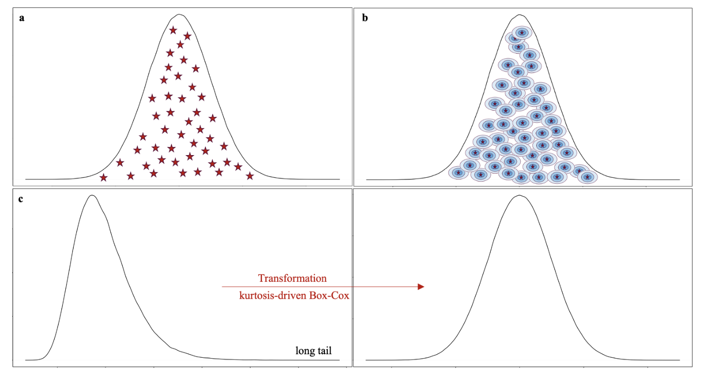

# Users’ Manual of Kernel-smoothed Permutation
Kernel-smoothed permutation is a method that constructs the null distribution of a test statistic through a novel kurtosis-driven Box-Cox transformation, followed by a kernel-based density estimation (KDE). 

## Overview
In genetic studies, permutation tests serve as a cornerstone to estimate P-values. This is because researchers may design new test statistics without a known closed-form distribution, or the assumption of a well-established test may not hold. However, permutation tests require vast number of permutations which is proportional to the magnitude of the actual P-values. When it comes to genome-wide association studies where multiple-test corrections are routinely conducted, the actual P-values are extremely small, requiring a daunting number of permutations that may be beyond the available computational resources. Existing models that reduce the required number of permutations all assume a specific format of the test statistic to exploit its specific statistical properties. We propose Kernel-smoothed permutation which is a model-free method universally applicable to any statistic. Our tool forms the null distribution of test statistics using a kurtosis-driven transformation, followed by a kernel-based density estimation (KDE). We compared our Kernel-smoothed permutation to Naïve permutation using statistics from known closed-form null distributions. Based on three frequently used test statistics in association studies, i.e., t-test, sequence kernel association test (SKAT), and chi-squared test, we demonstrated that our model reduced the required number of permutations by a magnitude with the same or higher accuracy.   

## kernelSmoothedPerm function
We have developed an R function, kernelSmoothedPerm, to perform extreme P-value estimation of a test statistic without having to specify a closed-form distribution. 

`kernelSmoothedPerm.R`

- **Usage**
  - kernelSmoothedPerm(X_standard, X, pvalue_threshold)

- **Required R packages**
  - utilities
  - MASS
  - moments

- **Arguments**
  - **X_standard:** test statistic to be tested before performing permutation.
  - **X:** vector of permuted test statistics. We recommend a number larger than 1.1e+07 for P-value accuracy threshold at 1e-07 and a number larger than 1.1e+08 
           for P-value accuracy threshold at 1e-08.
  - **pvalue_threshold:** P-value accuracy threshold. Allowed values are 1e-07 and 1e-08.

- **Values**
  - **optimal_lambda:** optimal lambda for power transformation of permuted test statistics. If "none", then there is no need to perform the transformation; if 0, then perform the log 
                        transformation; if any other real value, then perform the power transformation as a^(optimal_lambda-1)/optimal_lambda.
  - **pvalue_naive:** P-value estimation for naive permutation.
  - **pvalue_kernel:** P-value estimation for kernel-smoothed permutation.
 
- **Steps**
  - **1:** Calculate P-value estimation for naive permutation.
  - **2:** Check kurtosis of permuted test statistics. If it is very close to 3, then there is no need to perform the transformation.

## Contacts
Jiayi Bian: jiayi.bian@ucalgary.ca  
Quan Long: quan.long@ucalgary.ca

## Copyright License (MIT Open Source)
Permission is hereby granted, free of charge, to any person obtaining a copy of this software and associated documentation files (the "Software"), to deal in the Software without restriction, including without limitation the rights to use, copy, modify, merge, publish, distribute, sublicense, and/or sell copies of the Software, and to permit persons to whom the Software is furnished to do so, subject to the following conditions:

The above copyright notice and this permission notice shall be included in all copies or substantial portions of the Software. THE SOFTWARE IS PROVIDED "AS IS", WITHOUT WARRANTY OF ANY KIND, EXPRESS OR IMPLIED, INCLUDING BUT NOT LIMITED TO THE WARRANTIES OF MERCHANTABILITY, FITNESS FOR A PARTICULAR PURPOSE AND NONINFRINGEMENT. IN NO EVENT SHALL THE AUTHORS OR COPYRIGHT HOLDERS BE LIABLE FOR ANY CLAIM, DAMAGES OR OTHER LIABILITY, WHETHER IN AN ACTION OF CONTRACT, TORT OR OTHERWISE, ARISING FROM, OUT OF OR IN CONNECTION WITH THE SOFTWARE OR THE USE OR OTHER DEALINGS IN THE SOFTWARE.
